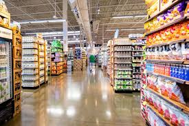
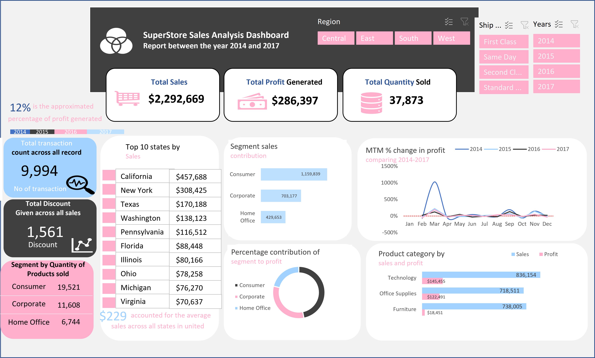
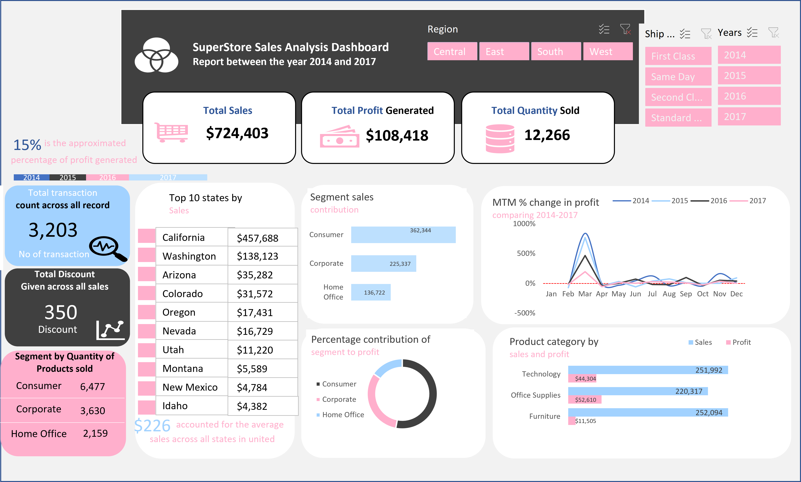
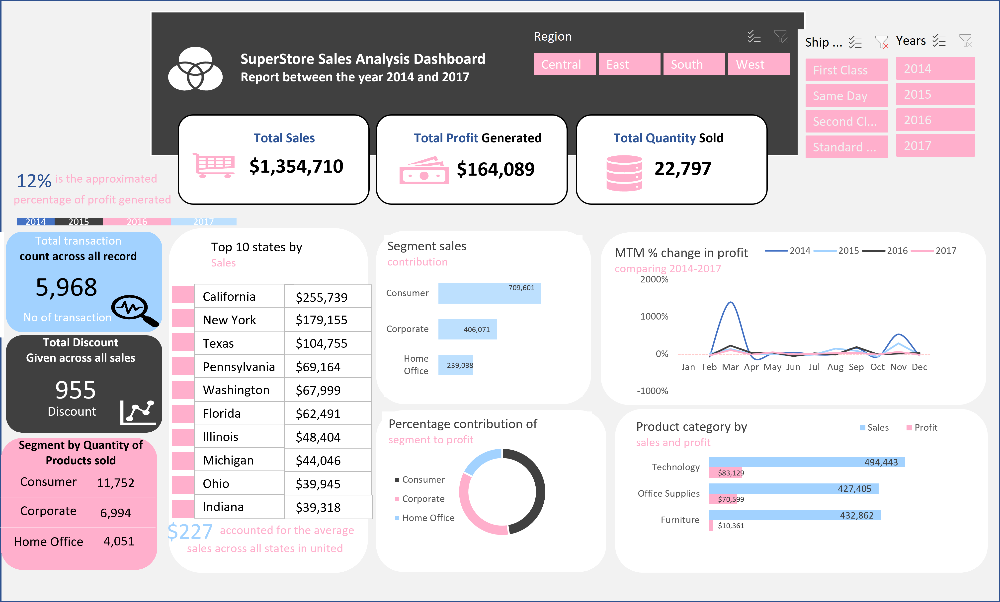
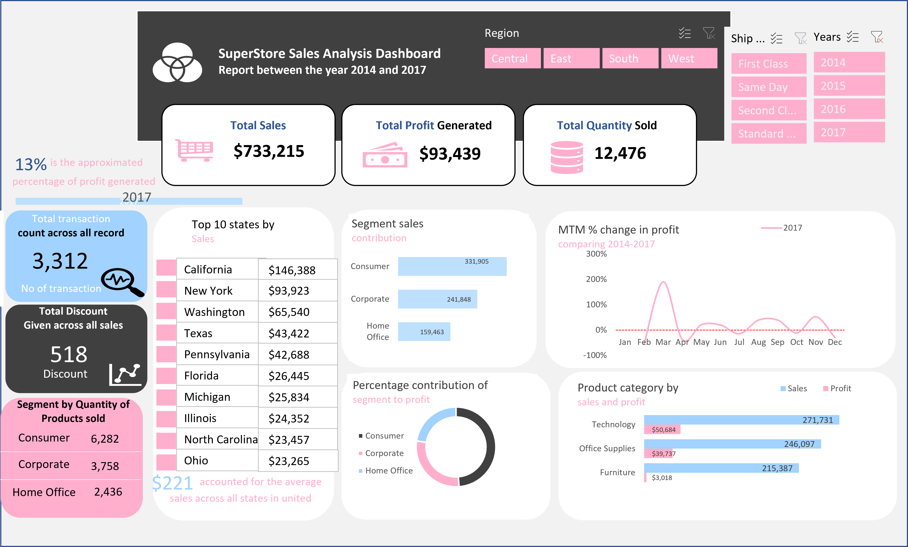

# SuperStore Sales Analysis

## Project overview:
This is a Microsoft Excel project aim to analyze, derive insights to answer crucial questions into the sales performance an e-commerce company(superstore) in the united states between the year 2014 and 2017, then help the store make data driven decisions.

## Problem statement:
1.	What is the total number of sales made between the year 2014 and 2017?
2.	Which ship mode recorded the highest sales?
3.	Which region recorded the highest sales?
4.	Which year has the highest sales returns?

## Data source:
The primary data used for this analysis is a cleaned data which contained detailed information about each sale made the company [Download here]( https://docs.google.com/spreadsheets/d/11LCCv19vJ-kR-FOXKy9rSJUFWg8Wa8dM/edit?usp=drive_link&ouid=101603672840358037610&rtpof=true&sd=true)

## Skills/ concepts demonstrated:
The following Microsoft Excel features were incorporated:
1.	Pivot table
2.	Pivot chart
3.	Data formatting
4.	Slicers
5.	Charts
6.	Sort and filter
7.	Reports 
8.	Icons 

## Visualization:
This dashboard comprises of 3 slicers for the following:
1.	Region
2.	Ship mode
3.	Years 
Kindly interact with the dashboard [here](https://docs.google.com/spreadsheets/d/1sgzL4uBhd-pJwDrJlgS3i382iXk5zW1E/edit?usp=drive_link&ouid=101603672840358037610&rtpof=true&sd=true)

The total sales of $2,292,669 generated $286,387 profit with 37,873 quantities of items sold

## Analysis:
1.	Region
The western region recorded the highest sales return of $724,403 over the given period of time

2.	Ship mode
Standard class ship mode recorded the highest sales of $1,354,710 over the given period of time

3.	Years
The year 2017 generated the highest sales of $733,215over the given period of time

## Conclusion:
We can conclude that:
1.	California has the highest sales among the top ten cities between the year 2014 and 2017.
2.	The highest profit was recorded between the month of February and April of 2014.

